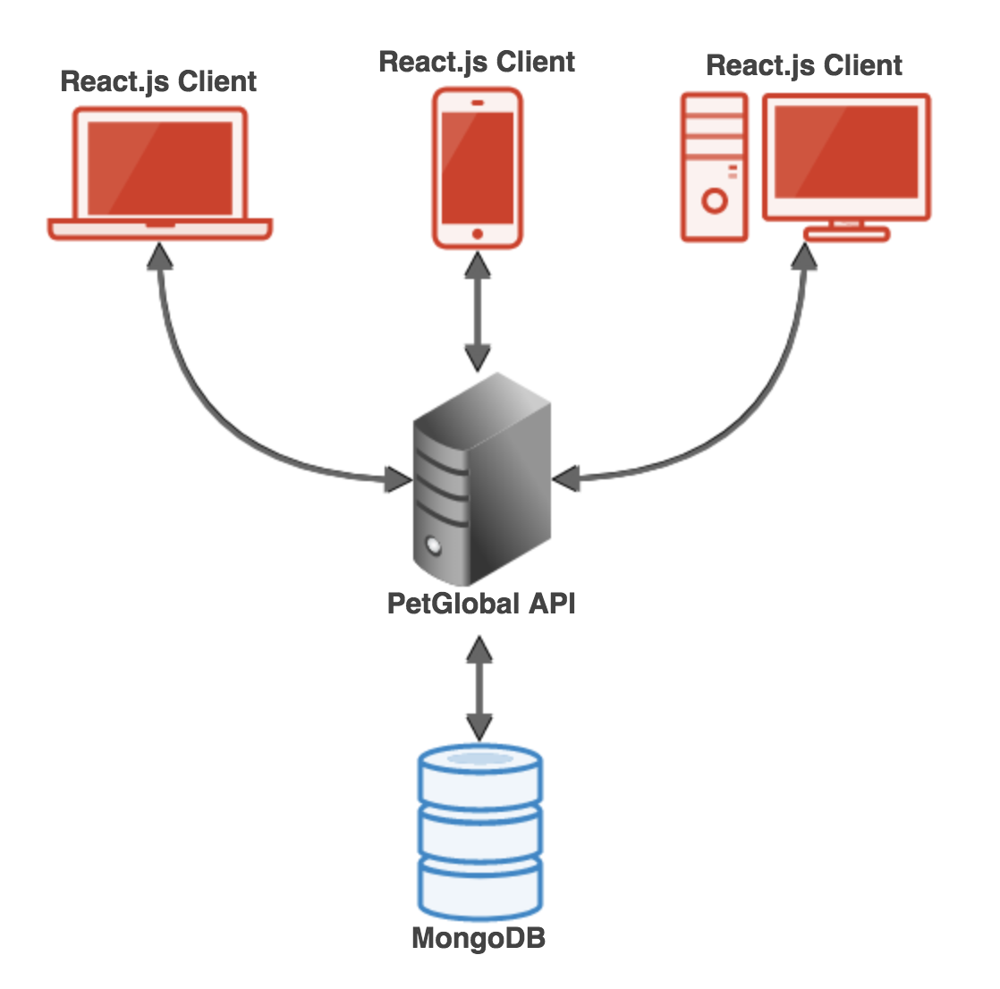
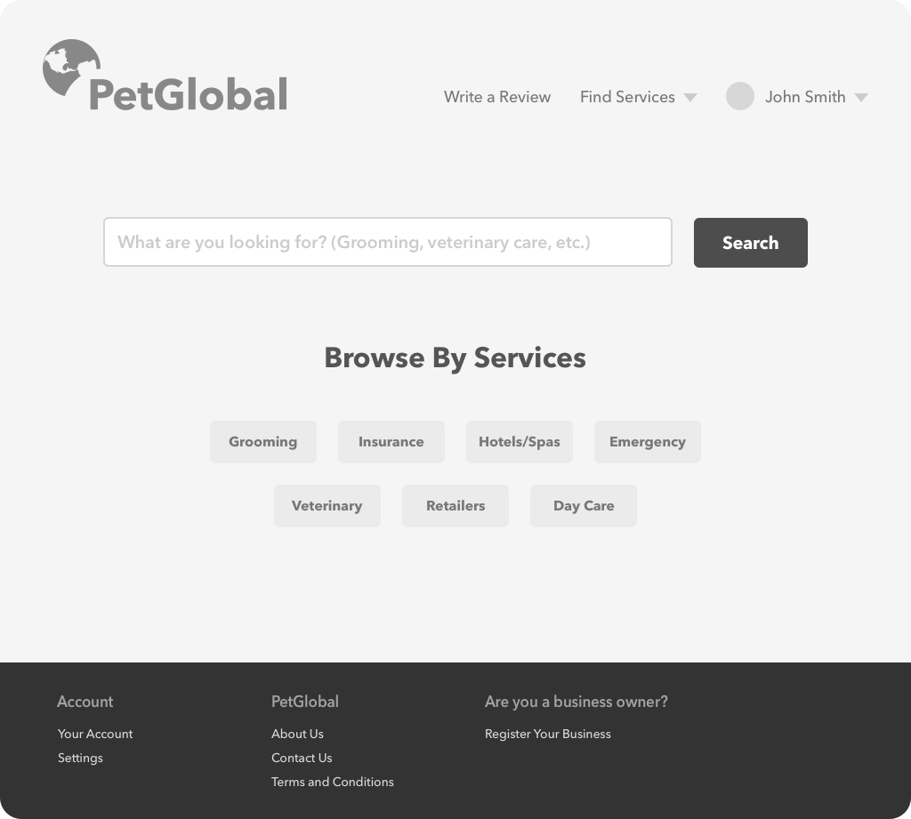

# PetGlobal

PetGlobal is a website that serves as a platform for pet-related businesses to connect with customers in the Northern Virginia/Washington D.C. metro area.

It offers users the ability to search for businesses providing pet related services. Users will be able to write reviews and see what others have to say about their consumer experiences.

PetGlobal will distinguish itself from other similar businesses by providing a top-quality service focused on the needs of pet owners and the pet products/services industry.

PetGlobal's list of services will include:

- Pet retailers
- Pet insurance providers
- Grooming services
- Relocation services
- Hotels and spas
- Veterinary care providers
- Emergency care providers

## Table of Contents

- [Getting Started](#getting-started)
- [Key Features](#key-features)
- [Tech Used](#tech-used)
- [Architecture Diagram](#architecture-diagram)
- [UI Mockup](#ui-mockup)
- [API Docs](#api-docs)
- [Database](#database)
- [Future Plans](#future-plans)

## Getting Started

### Installing Dependencies

Install both the server and client dependencies by running

```
yarn install
cd client
yarn install
cd ..
```

### Seeding the Database

Although PetGlobal accepts manual business registrations it still tries to build a directory of *all* local businesses in the area in order to make the search feature work as expected.

In order to do this you can seed the database by running

```
yarn seed
```

This uses the Yelp Business Search API to pull information about nearby pet related services. It then categorizes them and stores them in the PetGlobal database.

> **Note:** This requires a MongoDB process to be running on the local machine or the MONGODB_URI environment variable set. By default PetGlobal will create and use a database called 'petglobal'.

### Running Locally

You can run the site locally by running:

```
yarn start
```

This will start the API server at http://localhost:3001 and the React.js client at http://localhost:3000.

> **Note:** This requires a MongoDB process to be running on the local machine or the MONGODB_URI environment variable set. By default PetGlobal will create and use a database called 'petglobal'.

### Deployment (Heroku)

In order to deploy to Heroku make sure you have downloaded and installed the [Heroku CLI](https://devcenter.heroku.com/articles/heroku-cli).

1. Initialize an empty git repository

    ```
    git init
    ```

2. Create a new Heroku app by running

    ```
    heroku create
    ```

3. Provision the free MongoDB, Cloudinary, and SendGrid addons

    ```
    heroku addons:create mongolab
    heroku addons:create cloudinary
    heroku addons:create sendgrid
    ```

4. Build the React client for deployment by running

    ```
    yarn build
    ```

5. Add and commit all changes to git

    ```
    git add .
    git commit -m "Initial commit"
    ```

6. Push to Heroku by running

    ```
    git push heroku master
    ```

This should complete the deployment to Heroku.

## Key Features

The PetGlobal website will offer a variety of features to both customers and businesses.

These features will make it easy for users to find the services they need and make informed decisions. For businesses they will provide a platform to advertise their services and receive valuable customer feedback.

#### Customer features

- Search for businesses using:
    - Search term
    - Category
    - Location
    - Average rating
- View business contact information, website, and get directions
- Contact businesses directly through the PetGlobal website
- Read and write reviews

#### Business features

- Register your business
    - Provide contact details and description of services
    - Add pictures of your business
- View and track customer reviews

## Tech Used

- [Node.js](https://github.com/nodejs/node)
- [Express.js Web Server](https://github.com/expressjs/express)
- [React.js](https://github.com/facebook/react)
- [MongoDB](https://www.mongodb.com/)
- [OAuth2](https://oauth.net/2/)
- [Heroku](https://heroku.com)
- [node-oauth2-server](https://github.com/oauthjs/node-oauth2-server)
- [bcrypt](https://github.com/kelektiv/node.bcrypt.js)
- [mongoose](https://github.com/Automattic/mongoose)
- [multer](https://github.com/expressjs/multer)
- [Google Maps Node.js Client](https://github.com/googlemaps/google-maps-services-js)

## Architecture Diagram



## UI Mockup



## API Docs

The PetGlobal API will be available on the server at the endpoint `/api`. The required content type for requests is `application/json` (unless otherwise noted) and all responses are in JSON.

### Authentication

Authentication conforms to the OAuth2 protocol. Clients that successfully authenticate will receive an access token and a refresh token in the format:

```
"access_token": <access token>
"refresh_token": <refresh token>
"expires_in": <time until expiration in seconds>
"type": "bearer"
```
    
The access token should be provided on all requests through HTTP headers:

```
'Authorization': 'Bearer <access_token>'
```

#### Using User Credentials

In order to login with user credentials (username/email and password) you should send `POST /api/oauth/token` with the following parameters:

```
"username": <username or email>
"password": <password>
"grant_type": "password"
"client_id": <client id>
"client_secret": <client secret>
```
    
The `client_id` and `client_secret` are used to identify the client application using the API. In our case there will be only one registered client for the React.js frontend application. In the future there may be multiple clients for other platforms such as iOS and Android.

> **Note:** This endpoint does not allow JSON. Data must be encoded `application/x-www-form-urlencoded`.

#### Using Refresh Tokens

Since the access token expires very quickly clients can use the provided refresh token to request a new one. This token should be persisted securely on the client device.

Using refresh tokens allows users to stay logged in without having to save their username and password locally.

To request a new access token using a refresh token send `POST /api/oauth/token` with the following parameters:

```
"refresh_token": <refresh token>
"grant_type": "refresh_token"
"client_id": <client id>
"client_secret": <client secret>
```

For information regarding `client_id` and `client_secret` see [Using User Credentials](#using-user-credentials).

> **Note:** This endpoint does not allow JSON. Data must be encoded `application/x-www-form-urlencoded`.

### API Endpoints

This is a list of all available API endpoints.

#### Accounts/Authentication

- `POST /api/register` - Registers a new user account

    **Parameters**

    - `username` - Desired username
    - `email` - Email address
    - `password` - Desired password
    - `first_name` - First name
    - `last_name` - Last name
    - `phone_number` *(optional)* - Phone number
    - `address` *(optional)* - Address
        - `street1` - Street address line 1
        - `street2` - Street address line 2
        - `city`
        - `state`
        - `zip_code`

- `GET /api/account` - Returns user details of the logged in user
- `PUT /api/account` - Updates the logged in user's account details

    **Parameters**

    - `username` *(optional)* - New desired username
    - `email` *(optional)* - Email address
    - `first_name` *(optional)* - First name
    - `last_name` *(optional)* - Last name
    - `phone_number` *(optional)* - Phone number
    - `address` *(optional)* - Address
        - `street1` - Street address line 1
        - `street2` - Street address line 2
        - `city`
        - `state`
        - `zip_code`

- `DELETE /api/account` - Closes the logged in user's account permanently
- `POST /api/oauth/token` - Request a new access token using [user credentials](#using-user-credentials) or [refresh tokens](#using-refresh-tokens)

    > **Note:** This endpoint does not allow JSON. Data must be encoded `application/x-www-form-urlencoded`.

    **Parameters**

    - `username` *(required if `grant_type` is "password")* - Username or email of the user to authenticate
    - `password` *(required if `grant_type` is "password")* - Password of the user to authenticate
    - `refresh_token` *(required if `grant_type` is "refresh_token")* - Refresh token provided by the server
    - `grant_type` - Authentication method ("password" or "refresh_token")
    - `client_id` - ID of the client application
    - `client_secret` - Secret key of the client application

- `POST /api/password/reset` - Sends an email with a password reset token to the user's email address

    **Parameters**

    - `email` - The email of the account to reset the password to

- `POST /api/password` - Updates the user's password

    **Parameters**

    - `password_reset_token` - The token received by email from the server
    - `new_password` - The new password

#### Users

- `GET /api/users/:username` - Returns the user with given username

#### Businesses

- `GET /api/businesses` - Returns top 20 most popular/highly rated businesses
- `GET /api/businesses/:id` - Returns the business with the given id
- `POST /api/businesses` - Registers a new business

    **Parameters**

    - `name` - Name of the business
    - `description` - Description of the business
    - `address` - Address of the business
        - `street1` - Street address line 1
        - `street2` - Street address line 2
        - `city`
        - `state`
        - `zip_code`
    - `email` *(optional)* - Contact email
    - `phone_number` *(optional)* - Contact phone number
    - `website` *(optional)* - URL of website
    - `service_categories` - Service categories applicable to this business (see [Service Categories](#service-categories))

- `PUT /api/businesses/:id` - Updates a registered business

    **Parameters**

    - `name` *(optional)* - Name of the business
    - `description` *(optional)* - Description of the business
    - `address` *(optional)* - Address of the business
        - `street1` - Street address line 1
        - `street2` - Street address line 2
        - `city`
        - `state`
        - `zip_code`
    - `email` *(optional)* - Contact email
    - `phone_number` *(optional)* - Contact phone number
    - `website` *(optional)* - URL of website
    - `service_categories` *(optional)* - Service categories applicable to this business (see [Service Categories](#service-categories))

- `DELETE /api/businesses/:id` - Deletes a registered business
- `POST /api/businesses/:id/images` - Uploads an image of the business

    > **Note:** This endpoint requires `multipart/form-data` encoding

    **Parameters**

    - `file` - The image file to upload

- `DELETE /api/businesses/:business_id/images/:id` - Deletes the image with the given ID for the business with the given ID

#### Reviews

- `GET /api/reviews` - If `business_id` is not specified this will return all of the reviews the current user has written, otherwise it will return all of the reviews for the given business

    **Parameters**

    - `business_id` *(optional)* - Database ID of the business

- `GET /api/reviews/:id` - Gets the review with the given id
- `POST /api/reviews` - Adds a new review for a specific business

    **Parameters**

    - `business_id` - Database ID of the business being reviewed
    - `overall_rating` - Overall rating (1 to 5) of the experience
    - `customer_service_rating` - Rating (1 to 5) on customer service
    - `quality_rating` - Rating (1 to 5) on quality of product or service received
    - `price_rating` - Rating (1 to 5) on the business' prices
    - `description` - Description of the service experience
    - `service_categories` - Applicable categories describing what services the customer was trying to receive (see [Service Categories](#service-categories))
    - `repeat_customer` - True/false whether or not the user would go back
    - `transaction_occurred` - True/false whether or not the user paid money for a service or bought something while they were there
    - `date` - When they went to/contacted the business

- `PUT /api/reviews/:id` - Updates a review

    **Parameters**
    - `overall_rating` *(optional)* - Overall rating (1 to 5) of the experience
    - `customer_service_rating` *(optional)* - Rating (1 to 5) on customer service
    - `quality_rating` *(optional)* - Rating (1 to 5) on quality of product or service received
    - `price_rating` *(optional)* - Rating (1 to 5) on the business' prices
    - `description` *(optional)* - Description of the service experience
    - `service_categories` *(optional)* - Applicable categories describing what services the customer was trying to receive (see [Service Categories](#service-categories))
    - `repeat_customer` *(optional)* - True/false whether or not the user would go back
    - `transaction_occurred` *(optional)* - True/false whether or not the user paid money for a service or bought something while they were there
    - `date` *(optional)* - When they went to/contacted the business

- `DELETE /api/reviews/:id` - Deletes the review with the given ID.

#### Search

- `GET /api/search` - Returns a list of businesses for the specified search terms

    **Parameters**

    - `q` *(optional)* - Search query
    - `service_categories` *(optional)* - List of service categories (see [Service Categories](#service-categories))
    - `location` *(optional)* - Latitude/longitude of user
    - `rating_minimum` *(optional)* - Minimum star rating

### Service Categories

The PetGlobal API uses service categories to group businesses by what services they provide.

**The current list of all available service categories is:**

- `retail`
- `insurance`
- `grooming`
- `relocation`
- `hotels_and_spas`
- `veterinary`
- `emergency`


## Database

PetGlobal uses a MongoDB database backend with the following models.

### User
| Field | Type |
| --- | --- |
| _id | `ObjectId` |
| createdAt | `Date` |
| updatedAt | `Date` |
| username | `String` |
| email | `String` |
| hashedPassword | `String` |
| firstName | `String` |
| lastName | `String` |
| phoneNumber | `String` |
| address | `Object` |
| location | `String` |
| businesses | **one-to-many** `Business` |
| reviews | **one-to-many** `Review` |

### OAuthToken
| Field | Type |
| --- | --- |
| _id | `ObjectId` |
| accessToken | `String` |
| accessTokenExpiresAt | `Date` |
| refreshToken | `String` |
| refreshTokenExpiresAt | `Date` |
| client | `Object` |
| clientId | `String` |
| user | `Object` |
| userId | `String` |

### OAuthClient
| Field | Type |
| --- | --- |
| _id | `ObjectID` |
| clientId | `String` |
| clientSecret | `String` |
| grants | `Array` |
| redirectUris | `Array` |

### Business
| Field | Type |
| --- | --- |
| _id | `ObjectId` |
| createdAt | `Date` |
| updatedAt | `Date` |
| name | `String` |
| description | `String` |
| serviceCategories | `Array` |
| address | `Object` |
| location | `String` |
| email | `String` |
| phoneNumber | `String` |
| website | `String` |
| images | **one-to-many** `BusinessImage` |
| reviews | **one-to-many** `Review` |
| user | **belongs-to** `User` |

### BusinessImage
| Field | Type |
| --- | --- |
| _id | `ObjectId` |
| url | `String` |
| business | **belongs-to** `Business` |

### Review
| Field | Type |
| --- | --- |
| _id | `ObjectId` |
| createdAt | `Date` |
| updatedAt | `Date` |
| overallRating | `Number` |
| priceRating | `Number` |
| customerServiceRating | `Number` |
| qualityRating | `Number` |
| description | `String` |
| serviceCategories | `Array` |
| repeatCustomer | `Boolean` |
| transactionOccurred | `Boolean` |
| date | `Date` |
| user | **belongs-to** `User` |
| business | **belongs-to** `Business` |

## Future Plans

- Build a business facing cross-channel advertising platform
- Expand business interaction features
    - Add the ability to make appointments/reservations right from the PetGlobal site
    - Request quotes for services
- Build a system to find businesses having special promotions, deals, or discounts
- Use data analytics/machine learning to track review trends and send updates to users about popular businesses or events
